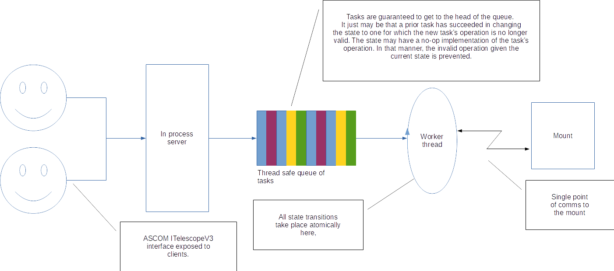
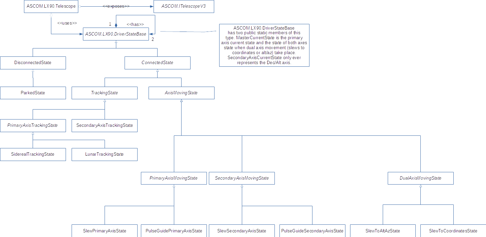
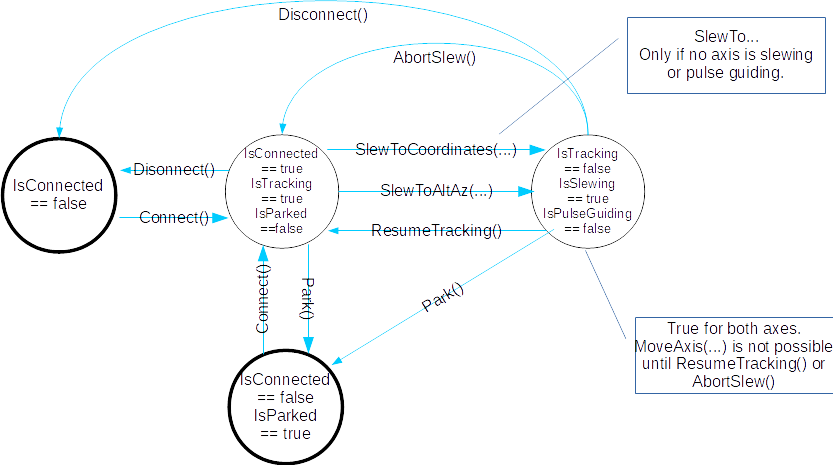
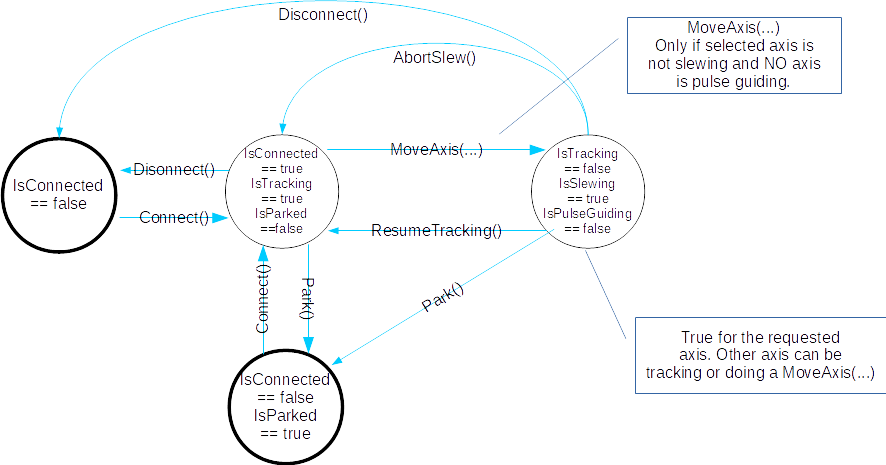
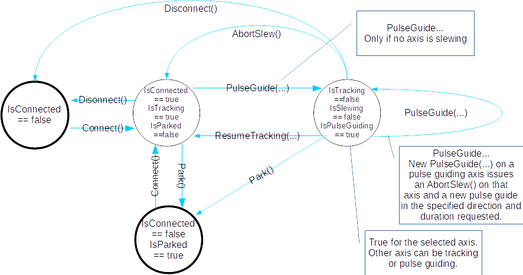
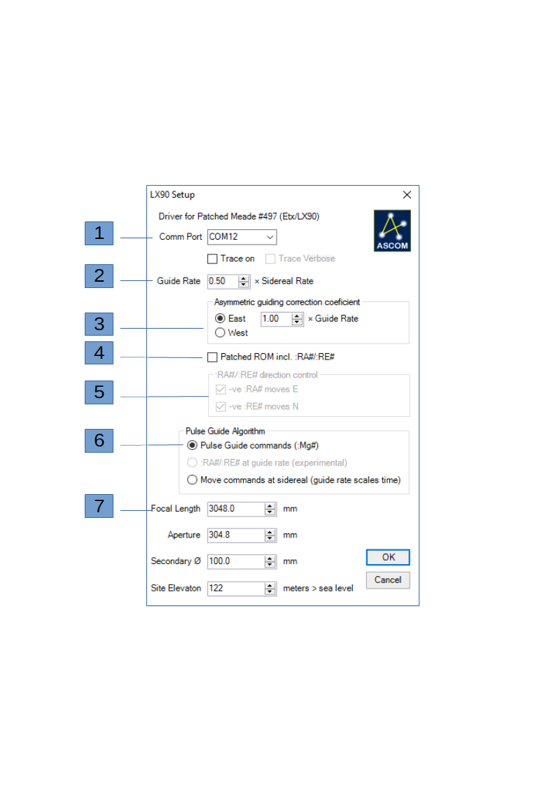

# Patched-497

## Introduction.
Patches are available for Meade #497 handboxes. These add some new capabilities to the Meade LX90 and Etx model telescopes. Stock ASCOM drivers know nothing of these systems so this driver attempts to make features available via ASCOM that otherwise would not be.

This driver is for use with patched Meade #497 HBX systems. Typically LX90 and ETX model telescopes. The patches have been developed and maintained by Richard Seymour and Andrew Johansen in particular.

To that end, <a href="https://groups.yahoo.com/neo/groups/lx90/info" target="browser">the LX90 Yahoo Group</a> is regularly frequented by both Richard (Dick) and Andrew.

## The reason for another ASCOM driver.

Let's go back through some of the issues we were attempting to address with my Meade LX90 LNT circa 2007.
 1. Horrendous periodic error.
 2. With such large periodic error, large movements were necessary to correct it and this required the use of ± 1 × sidereal rate slews to correct instead of the finer ± 0.5 × sidereal rate pulse guiding.
 3. This came with the additional feature of mismatched E and W slews for any given slew time. This was partially caused, at least I believe so, by an E-ward drift overall. This has been bourne out by the final PEC achieved showing lopsided sine wave.
 4. Pulse Guiding appeared to not work with the stock Meade Classic/#497 ASCOM driver.
 
All of this made the results using PHD/2 Guiding and PEM Pro (v2 now using v3) less than ideal. PHD/2 would inevitably overshoot or undershoot due to the E/W asymmetry and PEM Pro relies on pulse guiding to accurately program mounts that it cannot directly write PEC data to. Worse than that, the attempted movement commands by PEM Pro would back up the FIFO on the #497 handbox such that the PEM Pro PEC step (once every 3.72s) would fall out of step with the Meade #497 which was struggling to clear its FIFO.

This all led to the decision to write an ASCOM driver with these deficiencies in mind and to address asymmetric movement at sidereal rate.

Having made this decision and having applied various SW patches to my scope's #497, it seemed sensible to take advantage of any patches I have applied that might benefit other owners of scopes like mine with the patched ROM

## Prerequisites.

Install Visual Studio 2013. Specifically you need to be able to develop in C#.

ASCOM Driver Development and prerequisites are found at <a href="http //ascom-standards.org/Developer/DriverImpl.htm" target="browser">ASCOM Driver Development</a>

Familiarise yourself with the prerequisites and installation of the framework. Install the ASCOM Driver Development prerequisites and the developer components and after Visual Studio first.

Install the Inno Setup Compiler. Currently I use 5.58 because the latest version does not play nicely with the script template ASCOM provide.

The inno script for installing the release build of the driver when you have successfully built it is "Patched497/Patched497 Setup.iss". This does everything to ensure the driver is available to ASCOM. i.e. You can pick the driver from the list ASCOM provides.

Further documentation specific to this driver is found in the provided Readme.htm and comments throughout the source code.

## Caution.

The code should generally be thought of as highly experimental. The only test systems available to the developer (me) are a circa 2007 12" LX90 LNT, and a similarly aged ETX 125.

## Software Architecture.

The driver is implemented as a GoF State Pattern. State transition diagrams are provided in the docs/ directory.

### ASCOM Telescope Interface.

The ASCOM.LX90.Telescope driver exposes the <a href="http://www.ascom-standards.org/Help/Platform/html/T_ASCOM_DeviceInterface_ITelescopeV3.htm" target="browser">ASCOM ITelescopeV3 interface.</a>

The driver attempts to rigorously adhere to the expectations of this interface in terms of exceptions thrown and states that test true/false post calling the functions on that interface, and what next states or functions are valid etc.

### Overview.

   

In summary, there is a single thread managing a thread safe queue of tasks. The tasks are anything that talks to the mount. Tasks are queued and the queue is serviced. The GoF State pattern
ensures that only tasks that are legal for the current state are performed. All other tasks are no-ops.

### Class Diagram.

   

The telescope axes are managed by independent states. When slewing to a location (Alt/Az or RA/Dec) the axes are set to a single "DualAxisSlewingState" subclass. For individual axis movements
such as pulse guiding or moving the axis by an ASCOM.Telescope MoveAxis call, each axis has its own independent state.

Correct combinations of states are enforced across axes. 

E.g. 

 1. PrimaryAxis in TrackingState and SecondaryAxis in Tracking State.
 2. Either axis in TrackingState and the other axis in PulseGuide...State.
 3. Either axis in TrackingState and the other axis in Slew...AxisState.
 4. Both axes in pulse guiding state.
 5. Both axes in Slew...AxisState.
 6. DualAxisSlewingState (SlewToAltAzState or SlewToCoordinatesState).
 7. Any single axis pulse guiding with any slew is disallowed.
 8. Any dual axis slew with any pulse guiding is disallowed.
 9. Any single axis Slew...AxisState with any pulse guide or dual axis slew is disallowed.
 10. Any slew can be interrupted by AbortSlew. So changing from one thing to another generally requires the issue of AbortSlew then the change to the desired movement.

### State Transitions.

Start and end states have bold outlines. State transitioning operations are shown. These are the functions that atomically change the axis/dual axis state to a new state. If a state object does not support a particular function because it is invalid for that state, it simply does not override the function concerned and the default implementation on DriverStateBase (see the class diagram above) is called and the result is a no-op.

Fundamentally the architecture follows the state transition diagram, and the requirements of the ASCOM ITelescopeV3 interface and prevents invalid operations on any given state and prevents deviation from the expectations of the ASCOM.ITelescopeV3 interface by simply providing no pathway to do the wrong thing - at least, sans-bugs, that is the intent expressed in the design and state transition diagrams below.

#### Slew to Alt/Az|celestial coordinates.

The state transitions diagrammed here represent movement by the mount on both axes to a location on the sky by a coordinate system.

   
   
#### Move single axis.   

The state transitions diagrammed here represent movement of a single axis under the control of the client such that the client starts the movement with MoveAxis(...) on the ASCOM ITelescopeV3 interface, and when done issues the same MoveAxis(...) command with a zero rate.

   
   
#### Pulse guide.

The state transitions diagrammed here represent pulse guiding. Three pulse guding algorithms are provided.

This is also where the asymmetric guiding correction coefficient (overly fancy name for "fudge factor")
is used to further scale the duration of the actual time spent moving in the given guide direction. Pulse guiding is not optional. Three algorithms are provided:
 1. Pulse guide commands. Meade pulse guide commands are issued. On my LX90 these move the scope at an offset from sidereal of ± 0.5 × sidereal rate. i.e. The motor is always driving W, never stopped. Note, there is some funkiness around these commands especially if you have changed time zones or similar. I have seen the following behaviour: Turn on the mount. Experiment with pulse guiding. Mount moves. Change timezone. Mount no longer responds to pulse guide commands. The problem appears to be a long standing bug in the Meade firmware. The mount can get its local sidereal time thoroughly wrong, toggling the time zone fixes this but can kill pulse guiding. Go figure.
 2. :RA#/:RE# at guide rate. The driver issues the command to move the mount and to stop the slew in the direction requested when the pulse guide time is elapsed. Whatever arbitrary guide rate you set, the driver will issue :RA#/:RE# commands at that arbitrary rate. Experimentally using PHD/2 and a guide pulse of 5000ms the following are the results at different guide rates:
     * 1.0 × sidereal rate shows movement of 5 sidereal seconds (5 sec in RA). This is like the "Move commands at sidereal" below.
     * 0.5 × sidereal rate shows between 2 and 3 sidereal seconds (2-3 sec in RA). i.e. Guiding is moving the scope at an offset from sidereal of ± 0.5 × sidereal rate.
     * 0.25 × sidereal rate shows movement of approximately 1 sidereal seconds (1 sec in RA). i.e. Guiding is moving the scope at an offset from sidereal of ± 0.25 × sidereal rate.
 3. Move commands at sidereal. On my LX90 these move the scope at an offset from sidereal of ± 1.0 × sidereal rate. i.e. Guide W = 2 × sidereal. Guide E = motor stopped. The driver issues the command to move the mount and to stop the slew in the direction requested when the pulse guide time is elapsed. These are the classic Meade move commands at sidereal scaled by the guide rate. e.g. Specify a guide rate of 0.5 and pulse guide durations requested will be scaled by 0.5 such at a 1s guide pulse becomes a 0.5s move. </li>

   

## A note about :RA# and :RE# commands.

These Meade commands are very fickle as near as I can tell. All manner of tides, the position of the planets, a disturbance in the Earth's magnetic field seem to be able to prevent these
from working correctly. I have been unable to find the correct combination to make these commands work consistently ALL the time.

## Driver setup dialog.

   

Referring to the dialog above:

 1. Select the COM port your mount is on. Currently this is manual.
 2. Guide Rate. Set whatever your guide rate ACTUALLY proves to be here if you can use the Meade Pulse Guide commands or custom guide rate you want if you intend to guide with :RA#/:RE# commands on your mount. See the notes above about using Meade move commands and using this value to scale time at sidereal rate. Experimentally pulse guide commands on my LX90 yield a guide rate 0.5 × Sidereal. If you can only use the Meade move commands at sidereal, this value will be used to scale the time of the sidereal movements such that the mount behaves as if its guide rate is the value you specified here.
 3. This is where you can compensate for asymmetric guide slew performance. You may see this calibrating a guiding program like PHD/2 guiding for example. Fundamentally, equal time slewed E/W yields a different distance moved. The value entered here will scale the time of the slew in the direction selected (East/West) such that you should be able to obtain an equal distance slewed over time in each direction. Scale down not up. i.e. Scale such that a shorter guide pulse will move the same distance in the axis that moves greatest in a given time.
 4. Check to indicate that you wish to use the HIGHLY EXPERIMENTAL :RA#/:RE# features of a patched handset.
 5. Indicate whether L/R or Up/Down reversal is required for the mount to slew in the correct direction for :RA# or :RE# commands. Internally the reality is that the rate is set and :Me#/:Mw# or :Mn#/:Ms# are issued as per normal. The L/R or Up/Down reversal is achieved by changing the sign of the :RA# or :RE# command. E.g. :RA-1.5# followed by :Mw# on my mount will move the mount at 1.5 degrees/sec W and correspondingly, :RA-1.5# followed by :Me# will move E at 1.5 degrees/sec. In that example, I need to always negate the rate for slews to move in the correct direction. Experiment with your mount. Make sure you have set any date/time, location, timezone, etc. you need to first. It turns out these can determine which reversals are required. Best do the necessary the first time than discover your mount going the wrong direction later. See the note above about :RA#/:RE# commands. FICKLE.
 6. See the explanation of the pulse guiding algorithms above.
 7. Focal length, aperture, secondary diameter and site elevation are required by ASCOM but not obtained from the mount. These are static values and should match your mount, OTA and site location. 
